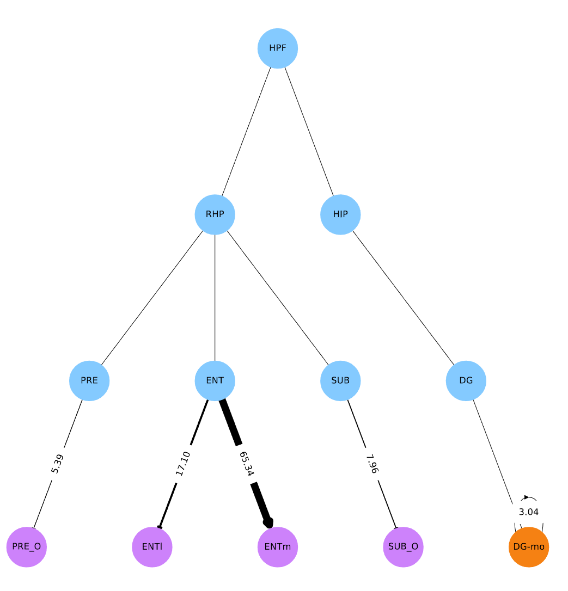

# Axon Projection

A code that analyses (long-range) axons provided as input, and classify them based on the brain regions they project to. Once the classification is done, the user can randomly sample an axon from a desired source brain region. The output of the sampling is a class assignment, a number of terminals for each target region, and a set of selected tufts that go well with this choice.

## Workflow

The workflow can either be run entirely, from classification to the sampling, by running the `run.py` script. Each step can also be run separately, by running modules individually.
Parameters for each step can be configured in a `.cfg` file, called at execution, *i.e.*:
```bash
python axonal_projections.py config_ML.cfg
```

These steps are executed in the following order:
- **axonal_projections.py**: creates a table that contains source region and number of terminals in each targeted regions, for every provided morphology. Hierarchy level of source and target regions can be controlled in the configuration file (the higher the level, the deeper into regions).
- **check_atlas.py** (optional): compares source regions found for the morphologies in the provided atlas, with source regions found elsewhere, typically from another atlas or manually assigned. Also checks the discrepancies between targeted regions for each morphology (*n.b.*: morphologies files tested should be the same and at the same disk location).
- **classify_axons.py**: runs the classification on the axonal projections table. Each morphology is grouped by source region, and feature vectors are defined by the number of terminals in each target region. Classification is unsupervised, and done by Gaussian Mixture Models (GMMs). The number of mixture components (*i.e.* number of classes) for each source is selected to minimize the Bayesian Information Criterion, which balances the likelihood of the dataset by the number of parameters used in the model.
The output of this step, is the creation of classes for each source region, defined by :
    - a probability to belong to this class;
    - the mean number of terminals in each target region;
    - the variances of these numbers of terminals;

  and the assignment to each class for every morphology in the dataset.
- **visualize_connections.py** (optional): for each class, creates a graph of connectivity to other regions. Connectivity strengths are also shown, computed as $s = \frac{N_r}{N_T}$, with $N_r$ is the total number of terminals in the target region in the entire class, divided by $N_T$, the total number of terminals of all the axons in this class. 

|<p align="center"></p>|
|:---:|
| *Orange nodes are for source region, purple for target regions, and blue for intermediary hierarchy to traverse (*i.e.*: DG-mo is in DG, which is in HIP, etc...).* |


- **separate_tufts.py**: clusters and saves the tufts of each morphology by region, with their topological barcodes. Also computes how each tuft is representative of its class, by comparing the difference of the tuft with all the others tufts of its class, based on a set of morphometrics (defined in the configuration file). This representativity score ranges from 0 (not representative) to 1 (representative).
- **sample_axon.py**: uses the previously defined GMMs to sample an axon from a specified source region. This draws a class assignment, and a number of terminals in each target region. Appropriate tufts are then selected, based on this number of terminals and the tufts' representativity score. The output is a tuft tuple, which, among others, contains the tuft topological barcode, which can be used for topological synthesis.

## Installation

TODO: Replace this text by proper installation instructions.


## Examples

The `example` folder contains some files to run an example of the code.

The `example/config_example.cfg` configuration file provides the parameters for each step of the workflow. The workflow can be run by executing the script `example/run_example.sh`, which basically places the user in the modules directory, and runs the complete workflow:
```bash
cd ../axon_projection
python run.py ../example/config_example.cfg
```

The output is generated in the `example/out_example` folder.
